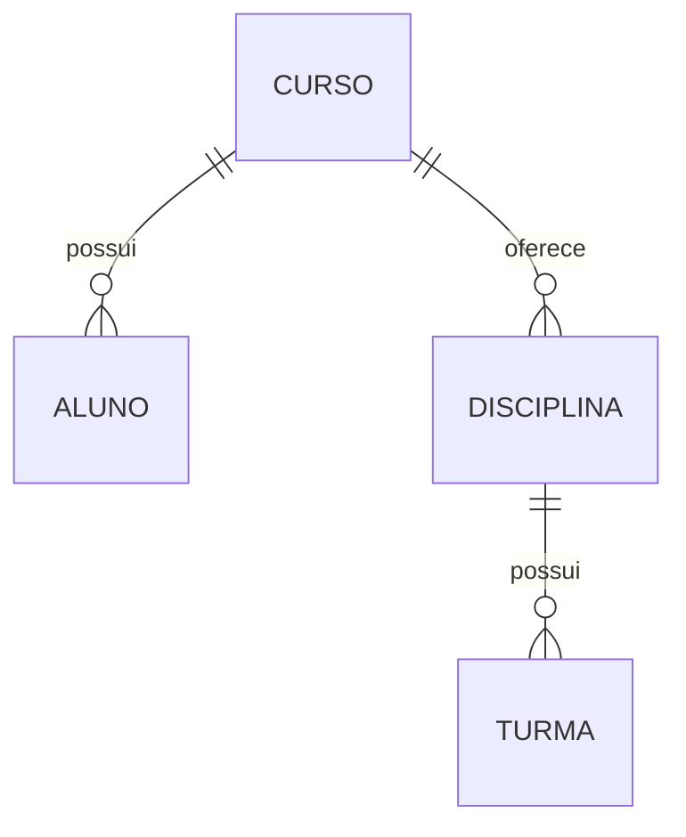
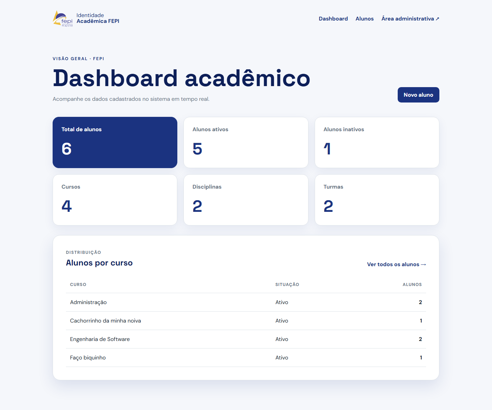
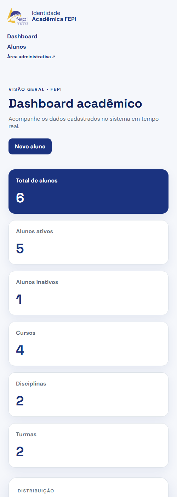

# Cartão de Identidade Acadêmica

Projeto Django para cadastro e consulta de identidades acadêmicas dos alunos da FEPI.

Repositório: <https://github.com/Biancafrs/cartao-identidade-aluno>

## Entrega da semana 1

A entrega inclui:

- quatro models de domínio: `Aluno`, `Curso`, `Disciplina` e `Turma`;
- relações 1:N protegidas contra exclusão acidental;
- migração dos cursos textuais existentes para registros de `Curso`;
- dashboard com indicadores calculados a partir do banco;
- CRUD de alunos, busca por nome ou CPF e filtro por curso;
- dados demonstrativos reproduzíveis e testes automatizados.

## Tecnologias

- Python 3.12 ou mais recente compatível com Django 6.1;
- Django 6.1;
- SQLite;
- HTML e CSS.

O desenvolvimento foi validado localmente com Python 3.14.7 e Django 6.1.

## Instalação

Clone o repositório:

```bash
git clone https://github.com/Biancafrs/cartao-identidade-aluno.git
cd cartao-identidade-aluno
```

No Windows:

```powershell
python -m venv venv
.\venv\Scripts\Activate.ps1
python -m pip install -r requirements.txt
python manage.py migrate
```

No Linux:

```bash
python3 -m venv venv
source venv/bin/activate
python -m pip install -r requirements.txt
python manage.py migrate
```

Para acessar a área administrativa, crie um usuário local. Nenhuma credencial é mantida no código:

```bash
python manage.py createsuperuser
```

Inicie o servidor:

```bash
python manage.py runserver
```

Acesse <http://127.0.0.1:8000/>.

## Dados de demonstração

O comando abaixo cria ou atualiza dados fictícios sem apagar registros existentes:

```bash
python manage.py popular_demo
```

Em um banco vazio, o resultado é:

- 4 alunos, sendo 3 ativos e 1 inativo;
- 2 cursos, com 2 alunos em cada;
- 2 disciplinas;
- 2 turmas.

O comando usa identificadores estáveis e pode ser executado novamente sem duplicar seus registros.

## Rotas

| Rota | Função |
| --- | --- |
| `/` | Dashboard com indicadores e alunos por curso |
| `/aluno/` | Listagem, busca e filtro de alunos |
| `/aluno/novo/` | Cadastro de aluno |
| `/aluno/<id>/` | Detalhes do aluno |
| `/aluno/<id>/editar/` | Edição do aluno |
| `/aluno/<id>/excluir/` | Confirmação de exclusão |
| `/admin/` | Administração de alunos, cursos, disciplinas e turmas |

## Modelo de dados



- `Aluno.curso` usa `ForeignKey` com `related_name="alunos"`.
- `Disciplina.curso` usa `ForeignKey` com `related_name="disciplinas"`.
- `Turma.disciplina` usa `ForeignKey` com `related_name="turmas"`.
- Todas as relações usam `PROTECT` para preservar registros dependentes.
- Carga horária e ano devem ser positivos; semestre aceita apenas 1 ou 2.

## Verificação

```bash
python manage.py check
python manage.py makemigrations --check --dry-run
python manage.py migrate
python manage.py test
```

A entrega foi validada com 24 testes, incluindo CRUD, filtros, dashboard vazio, indicadores, agrupamento, proteção das relações e idempotência do comando de demonstração.

## Evidências

### Dashboard em desktop



### Dashboard em tela estreita



O checklist detalhado está em [docs/entregas/semana-1/README.md](docs/entregas/semana-1/README.md).

## Autoria

- Bianca Ferreira — autoria identificada no repositório.

O nome e a participação do segundo integrante ainda precisam ser informados antes do envio da entrega.

## Uso de IA

Ferramentas de IA foram usadas como apoio ao planejamento, implementação, testes e documentação. O resultado foi verificado por comandos automatizados e inspeção visual.
